# Distributed Systems Practice

Notes from learning about distributed systems in [GW CS 6421](https://gwdistsys18.github.io/) with [Prof. Wood](https://faculty.cs.gwu.edu/timwood/)

## Area 1: Cloud Web Apps

> Beginner Level

[AWS Tutorial: Launch a VM](https://aws.amazon.com/getting-started/tutorials/launch-a-virtual-machine/) (time: 30 min)

Notes: In this lecture, I have learned how to lauch, configure, connect, and terminate an instance in the cloud. Besides, I have learned 2 linux commands:  `chmod` and `ssh` :

- chmod xxx filename . Change the access permissions, **ch**ange **mod**e. 3 digits stand for: user, group, and world. 4 means read, 2 means write, 1 means execute.

```
chmod 400 file.txt    // allow read by owner
chmod 740 file.txt     // allow read, write, execute by owner, allow read by group
chmod 777 file.txt    // allow everyone to read, write, and execute file
```

- ssh (SSH client) is a program for logging into a remote machine and for executing commands on a remote machine.

```
ssh -i file [user@]hostname    // here, -i means selecting a file from which the identity for RSA is read.
```

[QwikLab: Intro to S3](https://awseducate.qwiklabs.com/focuses/30?parent=catalog) (time: 25 min)

Notes: In this lab, I learned the basic usage of **S3** by finishing the tasks one by one. Amazon Simple Storage Service (Amazon S3) is storage for the Internet. Users can use Amazon S3 to store and retrieve any amount of data at any time, from anywhere on the web. Following the instructions, I have created a bucket in S3, added 2 pictures to my bucket, managed access permisson on pictures, created a Bucket Policy for permisson control, and tried to use bucked versioning.

> Intermediate Level

[Video: Virtualization](https://www.youtube.com/watch?v=GIdVRB5yNsk) (time: 20 min)

[AWS Tutorial: Install a LAMP Web Server on Amazon Linux 2](https://docs.aws.amazon.com/AWSEC2/latest/UserGuide/ec2-lamp-amazon-linux-2.html) (time: 45min)

In this practice, I learned how to install a **Lamp Web Server** on amazon Linux 2 by installing an Apache web server with PHP and MariaDB (a community-developed fork of MySQL) . We can use this server to host a static website or deploy a dynamic PHP application that reads and writes information to a database.

The first step is to prepare and lauch LAMP Server. When finishing connecting to the EC2 instance via SSH, we need to install the latest version of the LAMP MariaDB and PHP packages for Amazon Linux 2, then use **yum install** commond to install multiple software packages and related dependencies (such as httpd, mariadb-server). After that, we start the Apache webserver via `sudo systemctl start httpd` command. By the way, to test the web server in the web browser, we need to first add a security rule to allow inbound HTTP (port 80) to the instance, then type the public DNS address of the instance on browser, we can see the Apache test page. Besides, setting file permission inside `/var/www/html` to ensure we can add, delete, and edit files in the Apache document root.

The second step is to test the LAMP Server via creating a PHP file in the Apache document root. We use `echo` command to write something into a file. By entering the public DNS address plus the file address, we can see the webpage on the web browser.

The second step is to secure the database server because the default installation of the MariaDB server should be disabled or removed for production servers.

[QwikLab: Intro to DynamoDB](https://awseducate.qwiklabs.com/focuses/23?parent=catalog) (time: 20min)

In this lecture, I learned about **Amazon DynamoDB**. It is a fast and flexible NoSQL database service. It's also a fully managed database and supports both document and key-value data models.

In this lecture, I tried to create a table in Amazon DynamoDB, and added and edited some data to it, then tried to query and search data from it, finally I deleted the table I created. All of the operations can be done on the console by mouse clicking.

[AWS Tutorial: Deploy a Scalable Node.js Web App](https://aws.amazon.com/getting-started/projects/deploy-nodejs-web-app/?trk=gs_card) (time: 60min)

In this lecture, I tried to deploy a Node.js application with DynamoDB to Elastic Beanstalk. Elastic Beanstalk can us quickly deploy and manage applications in the AWS Cloud without worrying about the infrastructure that runs those applications. Here is the deployment architecture for this lecture.

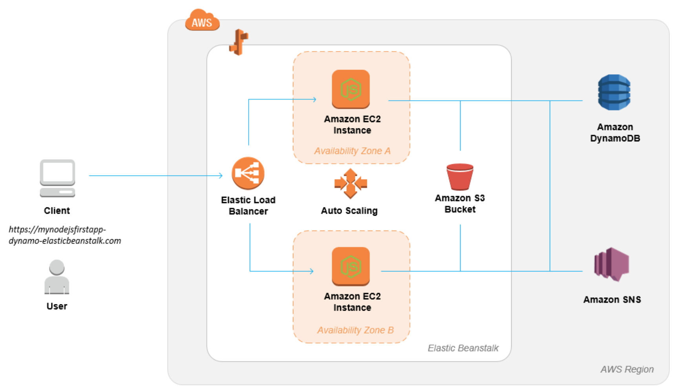

The first step is to **lauch an Elastic Beanstalk environment** via the Elastic Beanstalk console. Elastic Beanstalk will create the environment with the following resources:

- EC2 instance -- the configured virtual machine to run web apps

- Instance security group -- configured to allow ingress on port 80

- Load balancer -- configured to distribute request to the instance running the application and eliminate the need to expose the intance directly to the internet

- Load balancer security group -- configured to allow ingress on port 80

- Auto Scaling group -- configured to replace an instance if it is terminated or becomes unavailable

- Amazon S3 bucket -- store the source code, logs, and other artifacts that are created when using Elastic Beanstalk

- Amazon CloudWatch alarms -- monitor the load on the instances and are triggered if the load is too high or too low

- AWS CloudFormation stack -- lauch the resource in the environment and propagate configuration changes

- Domain name -- routes to the web app

The second step is to **add permissions** to the environment instance. For this lecture, the sample application uses instance permissions to write data to a DynamoDB table, and to send notifications to an Amazon SNS topic with the SDK for JavaScript in Node.js.

The third step is to **deploy the sample application** via uploading the application source bundle to Elastic Beanstalk. This web app will collect the name and email entered by user and store it to default DynamoDB.

To create our own DynamoDB, the fourth step is to **create a new DynamoDB table** and **reupload the application's configuration files**. To make the configurations, we need to change the signup email and the STARTUP_SIGNUP_TABLE to our own name. When redeploying the application,  the new DynamoDB table will store the information entered by users.

The finally step is to **configure the environment for high availability** via configuring the auto scaling group with a higher minimum instance count.

In a word, this lecture helps me to know the basic framework of Elastic Beanstalk and the basic steps to deploy the web apps and database on the Internet.

[QwikLab: Intro to AWS Lambda](https://awseducate.qwiklabs.com/focuses/36?parent=catalog) (time: 70min)

This lecture introduces AWS Lambda. AWS Lambda is a compute service that runs  developer's code in response to events and automatically manages the compute resources for developer, making it easy to build application that respond quickly to new information. AWS Lambda starts running the code within milliseconds of an event such as an image upload, in-app activity, website click, or output from a connected device. AWS Lambda can also be used  to create new back-end services where compute resources are automatically triggered based on custom requests. 

In this lecture, I tried to create an AWS Lambda function, configure an S3 bucket as a Lambda Event Source, then trigger a Lambda function by uploading an object to Amazon S3. Here is the application flow for AWS Lambda in this lecture:

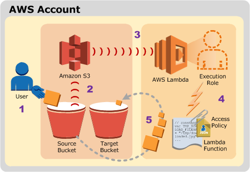

1. A user uploads an object to the source bucket in Amazon S3.

2. Amazon S3 detects the object-created event.

3. Amazon S3 publishes the object-created event to AWS Lambda by invoking the Lambda function and passing event data as a function parameter.

4. AWS Lambda executes the Lambda function.

5. From the event data it receives, the Lambda function knows the source bucket name and object key name. The lambda function reads the object and creates a thumbnail using graphics libraries, then saves the thumbnail to the target bucket.

The highlight of this lecture is creating an AWS Lambda function that reads an image from Amazon S3, resizes the image and then stores the new image in Amazon S3. Here we use a pre-written function: 

```python
import boto3
import os
import sys
import urllib
from PIL import Image
import PIL.Image

s3_client = boto3.client('s3')

def resize_image(image_path, resized_path):
    with Image.open(image_path) as image:
        image.thumbnail((128,128))
        image.save(resized_path)

def handler(event, context):
    for record in event['Records']:
        bucket = record['s3']['bucket']['name']
        key = record['s3']['object']['key']
        raw_key = urllib.parse.unquote_plus(key)
        download_path = '/tmp/{}'.format(key)
        upload_path = '/tmp/resized-{}'.format(key)

        s3_client.download_file(bucket, raw_key, download_path)
        resize_image(download_path, upload_path)
        s3_client.upload_file(upload_path,
             '{}-resized'.format(bucket),
             'thumbnail-{}'.format(raw_key),
             ExtraArgs={'ContentType': 'image/jpeg'})
```

As the above code shows, when being called, the python function `handler` will download the image, resize the image using function `resize_image`, and upload the resized image to the *-resized* bucket in Amazon S3.

The AWS Lambda function can be **triggered** automatically by activities. Here we need to configure a S3 trigger to active the AWS Lambda function.

Another interesting place is the **monitoring and logging** in AWS Lambda function. We can monitor AWS Lambda functions to identify problems and view log files to assist in debugging.

[QwikLab: Intro to Amazon API Gateway](https://awseducate.qwiklabs.com/focuses/21?parent=catalog) (time: 30min)

In this lecture, I created a simple FAQ micro-service. The micro-service will return a JSON object containing a random question and answer pair using an **Amazon API Gateway** endpoint that invokes an **AWS Lambda function**. Here is the architecture pattern for this micro-service: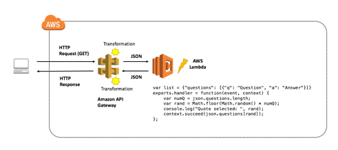

Amazon API Gateway is a managed service that creating, deploying and maintaining APIs easy. The steps in this lecture is similar with previous lecture: Creating a Lambda function first, then trigger the function via API Gateway. The lambda function (implemented with Node.js) defines a list of FAQs and returns a random FAQ. The API Gateway will produce a endpoint `https://8tx6efu970.execute-api.us-west-2.amazonaws.com/myDeployment/FAQ`. When we  copy endpoint to the browser, we can see a random FAQ entry, that means when users request server with this endpoint, the Lambda function developer created will be triggered.

Besides, I want to talk more about API. An **application programming interface** is a set of instructions that defines how developers interface with an application. The idea behind an API is to create a standardized approach to interfacing the various services provided by an application. An API is designed to be used with a **Software Development Kid (SDKs)**, which is a collection of tools that allows developers to easily create downstream applications based on the API.

Then, I learn about **API-First strategy**, which is adopted by many software organizations. It means that each service within their stack is first and always released as an API. When designing a service, it is hard to know all of the various applications that may want to utilize the service. For instance, the FAQ service in this lecture would be ideal to seed FAQ pages on an external website. However, it is feasible to think that a cloud education company would also want to ingest the FAQ within their training materials for flash cards or training documents. If it was simply a static website, the ingestion process for the education company would be very difficult. By providing an API that can be *consumed in a standardized format*, the microservice is enabling the development of an ecosystem around the service, and use-cases that were not initially considered. 

The last useful tip is about RESTful API, which refers to architectures that follow 6 constraints:

- **Separation of concerns** via a client-server model.

- **State** is stored entirely on the client and the communication between the client and server is **stateless**.

- The client will **cache** data to improve network efficiency.

- There is a uniform interface (in the form of an API) between the server and client.

- As complexity is added into the system, layers are introduced. There may be multiple layers of RESTful components.

- Follows a **code-on-demand** pattern, where code can be downloaded on the fly (in this lecture implemented in Lambda) and changed without having to update clients.

In this lecture, the steps follow the RESTful model. Clients send requests to backend Lambda function (server). The logic of service is encapsulated within the Lambda function and it is providing a uniform interface for clients to use.

[AWS Tutorial: Build a Serverless Web Application](https://aws.amazon.com/getting-started/projects/build-serverless-web-app-lambda-apigateway-s3-dynamodb-cognito/?trk=gs_card) (time: 90min)

In this tutorial, I experienced the power of AWS by building a serverless web application which enables users to request unicorn rides from the Wild Rydes fleet. This application presents users with HTML based user interface for indicating the location where they would like to be picked up and will interface on the backend with a RESTful web service to submit the request and dispatch a nearby unicorn. The application also provides facilities for users to register with the service and log in before requesting rides.

In this tutorial, I tried to use **AWS Lambda** to simulate the backend and response to the user requests, use **Amazon API Gateway** to interface user and backend, use **Amazon S3** to store the static website files,  use **Amazon DynamoDB** to store the histories of user request, and use **Amazon Cognito** to create and authenticate the user accounts. 


The above picture shows the architecture and steps of this application. Here is the summary of the four steps:

1. Amazon S3 hosts static web resources including HTML, CSS, Javascript, and image files which are loaded in the user's browser.

2. Amazon Cognito provider user management and authentication functions to secure the backend API.

3. Amazon DynamoDB provides a persistence layer where data can be stored by the API's Lambda function.

4. Javascript executed in the browser sends and receives data from a public backend API built using Lambda and API Gateway.

In the first step, I learned that the Amazon S3 can be used not only to store the data but to be a website hosting.

In the second step, I tried to create an Amazon Cognito user pool to manage the users' account of this application. When users visit the website they will first register a new user account. After users submit their registration, Amazon Cognito will send a confirmation email with a verification code to the address they provided. To confirm their account, users will return to the site and enter their email address and the verification code they received. After users have a confirmed account, they will be able to sign in. When users sign in, they enter their username (or email) and password. A JavaScript function then communicates with Amazon Cognito, authenticates using the Secure Remote Password protocol (SRP), and receives back a set of JSON Web Tokens (JWT). The JWTs contain claims about the identity of the user and will be used to authenticate against the RESTful API which is built with Amazon API Gateway.

The following is the function code for register and signin. We call `aws-cognito-sdk.min.js` and `amazon-cognito-identity.min.js` to achieve the Amazon Cognito.

```javascript
function register(email, password, onSuccess, onFailure) {
        var dataEmail = {
            Name: 'email',
            Value: email
        };
        var attributeEmail = new AmazonCognitoIdentity.CognitoUserAttribute(dataEmail);

        userPool.signUp(email, password, [attributeEmail], null,
            function signUpCallback(err, result) {
                if (!err) {
                    onSuccess(result);
                } else {
                    onFailure(err);
                }
            }
        );
    }

function signin(email, password, onSuccess, onFailure) {
  var authenticationDetails = new AmazonCognitoIdentity.AuthenticationDetails({
    Username: email,
    Password: password
  });

  var cognitoUser = createCognitoUser(email);
  cognitoUser.authenticateUser(authenticationDetails, {
    onSuccess: onSuccess,
    onFailure: onFailure
  });
}
```

In the third and fourth step, I tried to use AWS Lambda and Amazon DynamoDB to build a backend process for handling requests for the web application, and use Amazon API Gateway to expose the Lambda function as a RESTful API. 

The following code is the important part of the Lambda function. In this function, we not only return the information of a unicorn to the client but record the request history to Amazon DynamoDB.

```javascript
exports.handler = (event, context, callback) => {
    if (!event.requestContext.authorizer) {
      errorResponse('Authorization not configured', context.awsRequestId, callback);
      return;
    }

        // omit some code...

    recordRide(rideId, username, unicorn).then(() => {
        callback(null, {
            statusCode: 201,
            body: JSON.stringify({
                RideId: rideId,
                Unicorn: unicorn,
                UnicornName: unicorn.Name,
                Eta: '30 seconds',
                Rider: username,
            }),
            headers: {
                'Access-Control-Allow-Origin': '*',
            },
        });
    }).catch((err) => {
        console.error(err);
        errorResponse(err.message, context.awsRequestId, callback)
    });
};


function findUnicorn(pickupLocation) {
    console.log('Finding unicorn for ', pickupLocation.Latitude, ', ', pickupLocation.Longitude);
    return fleet[Math.floor(Math.random() * fleet.length)];
}

function recordRide(rideId, username, unicorn) {
    return ddb.put({
        TableName: 'Rides',
        Item: {
            RideId: rideId,
            User: username,
            Unicorn: unicorn,
            UnicornName: unicorn.Name,
            RequestTime: new Date().toISOString(),
        },
    }).promise();
}
```

Another interesting point in the fourth step is that we create a cognito user pools authorizer. Amazon API Gateway can use the JWT tokens returned by Cognito User pools to authenicate API calls. After that, we deploy the API Gateway to trigger the Lambda function.

> Bring it together

[AWS Tutorial: Build a Modern Web Application](https://aws.amazon.com/getting-started/projects/build-modern-app-fargate-lambda-dynamodb-python/?trk=gs_card) (time: 240min)

In this Tutorial, I tried to build a sample website called Mythical Mysfits that enables visitors to adopt a fantasy creature as pet. This project can be implemented in 5 modules and I will analyze the technologies in each modules step by step.

1. Create Static Website. Build a static website, using **Amazon Simple Storage Service** (S3) that serves static content (images, static text, etc.) for the website.

2. Build Dynamic Website. Host the application logic on a web server, using an API backend microservice deployed as a container through **AWS Fargate**.

3. Store Mysfit Data. Externalize all of the mysfit data and persist it with a managed NoSQL database provided by **Amazon DynamoDB**.

4. Add User Registration. Enable users to registration, authentication, and authorization so that Mythical Mysfits visitors can like and adopt myfits, enabled through **AWS API Gateway** and its integration with **Amazon Cognito**.

5. Capture User Clicks. Capture user behavior with a clickstream analysis microservice that will record and analyze clicks on the website using **AWS Lambda** and **Amazon Kinesis Firehose**. 


The topic of Module 1 is to upload the static web content. I host the static content of the website on **Amazon S3**. The detail steps is similar with the tutorial before which includes uploading static website files, changing the access permission of the contents, and publishing the website content to S3. Besides, I use **AWS Cloud9** as a command-line tool to deal with these tasks.

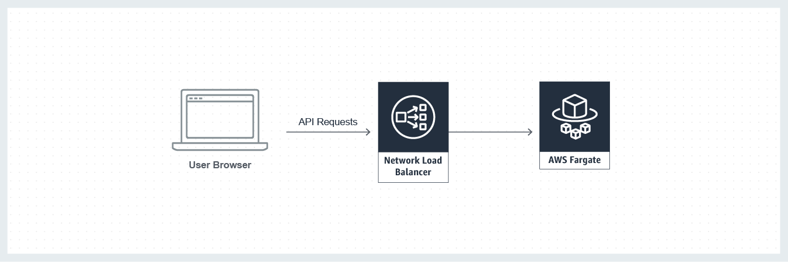

The Module 2 contains something new technologies. In this module, I create a new miroservice hosted using **AWS Fargate** so that my website can integrate with an application backend. AWS Fargate is a deployment option in **Amazon Elastic Container Service (ECS)** that allows user to deploy containers without having to manage any clusters or server. The reason to choose Fargate is that it's a great choice for building long-running processes such as microservices backends for web and mobile and PaaS platforms. With Fargate, we get the control of containers and the flexibility to choose when they run without worring about provisioning or scaling servers.

Before we can create our service, the first step is to create the core infrastructure environment that the service will use, including the networking infrastructure in **Amazon VPC**, and the **AWS Identity and Access Management Roles** that will define the permission that ECS and the containers will have on top of AWS. To achieve this task, we use **AWS CloudFormation**. AWS CloudFormation is a service that can programmatically provision AWS resources that we declare within JSON or YAML files called CloudFormation Templates, enabling the common best practice of infrastructure as code.  

The second step is to create a Docker container image that contains all of the code and configuration required to run the Mythical Mysfits backend as a microservice API created with Flask. In this step, I use **Cloud9** to build the Docker container image and then push it to the **Amazon Elastic Container Registry (ECR)**, where it will be available to pull when I create the service using Fargate. One thing need to noted here is that I should provision a **Network Load Balancer (NLB)** to sit in front of my service tier, rather than directly expose my backend service to the internet. This would enable my frontend website code to communicate with a single DNS name while my backend service would be free to elastically scale in-and-out based on demand or if failures occur and new containers need to be provisioned. After this step, the user can see my Mythical website which is retrieving JSON data from my Flask API running within a Docker container deployed to AWS Fargate.

The last step is for optimizing. I create a working CI/CD pipeline to deliver changes to that service automatically whenever I update my code repository, I can quickly move new application features from conception to available for my Mythical Mysfits users.


In Module 3, I create a table in **Amazon DynamoDB** which is mentioned in previous tutorial. Rather than have all of the Mysfits be stored in a static JSON file, I store them in a database to make the websites future more extensible scalable. The key step is to update the code of operating the DynamoDB to the CI/CD pipeline. The request is formed using the AWS Python SDK called boto3. This SDK is a powerful yet simple way to interact with AWS services via Python code. It enables the developers to use service client definitions and functions that have great symmetry with the AWS APIs and CLI commands they have already been executing as part of this workshop. When finishing this module, the user can see the new polulation of Mysfits loading from my DynamoDB table and how the Filter functionality is working.

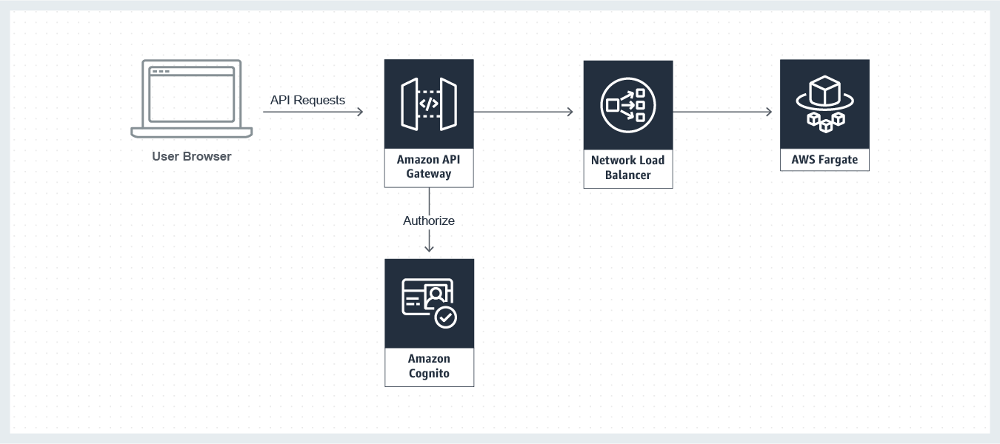

The Module 4 contains some familiar technologies I learned in the previous tutorials. The topic in this module is setup user registration. In order to add some more critical aspects to the Mythical Mysfits website, like allowing users to vote for their favorite mysfit and adopt a mysfit, I need to first have users register on the website. To enable registration and authentication of website users, I need to create a User Pool in **AWS Cognito** - a fully managed user identity management service. Then, to make sure that only registered users are authorized to like or adopt mysfits on the website, I need to deploy an REST API with **Amazon API Gateway** to sit in front of the NLB. The detailed steps is similar to the previous tutorial of AWS Cognito and Amazon API Gateway, the only key need attention is to configure an API Gateway VPC Link that enables API Gateways APIs to directly integrate with backend web services that are privately hosted inside a VPC. After this module, the users can register, login, view mysfits profiles, like, and adopt mysfits.

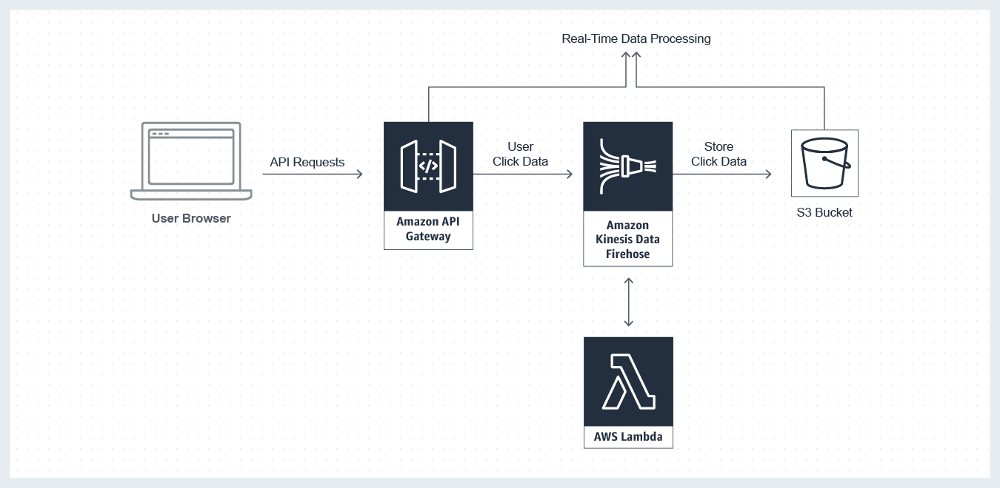

The final module is about the interacting between the users and my website and the user action data collection. It would be easy for me to analyze user actions taken on the website that lead to data changes in my backend - when mysfits are adopted or liked. But understanding the actions my users are taking on the website before a decision to like or adopt a mysfit could help me design a better user experience in the future that leads to mysfits getting adopted even faster. To help gather these insights, I implement the ability for the website frontend to submit a tiny request, each time a mysfit profile is clicked by a user, to a new microservice API I create. Those records are processed in real-time by a serverless code function, aggregated, and stored for any future analysis that I may want to perform. In this module, I use several technologies. Some of them are new: **AWS Kinesis Firehose delivery stream**, Kinesis Firehose is a highly available and managed real-time streaming service that accepts data records and automatically ingests them into several possible storage destinations within AWS, such as Amazon S3 bucket, or Amazon Redshift data warehouse cluster. Kinesis Firehose also enables all of the records received by the stream to be automatically delivered to a serverless function created with AWS Lambda This means that code I've written can perform any additional processing or transformations of the records before they are aggregated and stored in the configured destination. Others are familiar: **Amazon S3 bucket**, a new bucket is created in S3 where all of the processed click event records are aggregated into files and stored as objects; **AWS Lambda function**, AWS Lambda enables developers to write code functions that only contain what their logic requires and have their code be deployed, invoked, made highly reliable, and scaled without having to manage infrastructure whatsoever. Here, a Serverless code function is defined using **AWS SAM**. It will be deployed to AWS Lambda, written in Python, and then process and enrich the click records that are received by the delivery stream; **IAM Roles**, Kinesis Firehose requires a service role that allows it to deliver received records as events to the created Lambda function as well as the processed records to the destination S3 bucket. The Amazon API Gateway API also requires a new role that permits the API to invoke the PutRecord API within Kinesis Firehose for each received API request.

In conclusion, via the experiences from module 1 to module 5, I have built a modern application on top of AWS. I have mastered the usage of some AWS technologies mentioned above. I have learnt to use AWS resrouces not only by the AWS CLI but the AWS consoles. In addition, I am only very familiar with Python, but in this tutorial I feel the greatness of this language: the powerful extensive support libraries make me do all the thing I want!

## Area 2 Big Data and Machine Learning

> Beginner Level

[Video: Hadoop Intro](https://www.youtube.com/watch?v=jKCj4BxGTi8&feature=youtu.be) (time: 30min)

This video gives an overview on how the Big Data has evolved follwing with what is Hadoop, Hadoop key characteristics, Hadoop ecosystem components and Big Data processing. Firstly, I learn that Hadoop is a framework that allows for distributed processing of large data sets across clusters of commodity computers using simple programming models. Secondly, I learn that Hadoop has four key characteristics: economical *-- ordinary computers can be used for data processing*, reliable *-- Stores copies of the data on different machines and is resistant to hardware failure* , scalable *-- can follow both horizontal and vertical scaling*, and flexible *-- can store as much of the data and decide to use it later*. 

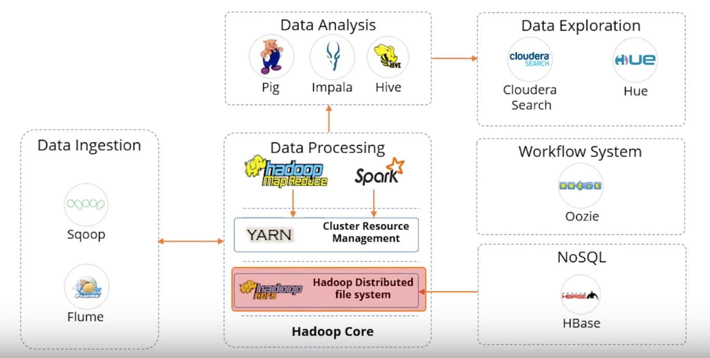

Thirdly, I learn the components of Hadoop ecosystem and their function. The **Hadoop distributed file system (HDFS)** is the storage layer for Hadoop and is suitable for the distributed storage and processing. The **HBase** is a NoSQL database or non-relational database which store the data in HDFS and is mainly used when we need random, real-time, read/wirte access to our big data. The **Sqoop** is a tool designed to transfer data between Hadoop and relational database servers and it is used to import data from relational database such as, Oracle and MySQL to HDFS and export data from HDFS to relational database. The **Flume** is a distributed service for ingeting streaming data and is ideally suited for event data from multiple system. The **Hadoop MapReduce** is the original Hadoop processing engine which is primarily java based and is based on the map and reduce programming model. The **Spark** is an open-source cluster computing framework which supports machine learning, business intelligence, streaming, and batch processing. Besides, the Spark can provide up to 100 times faster performance as compared to MapReduce. For data analysis, there are **Pig, Impala, and Hive**. For data exploration, the **Cloudera Search** enables non-technical users to search and explore data stored in or ingested into Hadoop and HBase. The **Hue** is an acronym for Hadoop user experience. The **Oozie** is a workflow or coordination system used to manage the Hadoop jobs.

Finally, I learn the four stages of big data, they are **Ingest, Processing, Analyze, and Access**.

[QwikLab: Analyze Big Data with Hadoop](https://awseducate.qwiklabs.com/focuses/19?parent=catalog) (time: 45min)

In this lab, I have a glimpse of Hadoop with **Amazon EMR**, which is a managed service that makes it fast, easy, and cost-effictive to run Apache Hadoop and Spark to process vast amount of data. Amazon EMR also supports powerful and proven Hadoop tools such as Presto, Hive, Pig, HBase, and more.

In this lab, I deploy a fully functional Hadoop cluster to analyze log data by lauching an Amazon EMR cluster. Then I use HiveQL script to process sample log data stored in an Amazon S3 bucket. **HiveQL** is a SQL-like scripting language for data warehousing and analysis. Here I use HiveQL to read the log files from Amazon S3 and parse the files using the Regular Expression Serializer/Deserializer, and then write the parsed results to a Hive table, then submit the HiveQL query against the data to retrieve the information I want, finally write the query results to my Amazon S3 output bucket.

> Intermediate Level

[QwikLab: Intro to S3](https://awseducate.qwiklabs.com/focuses/30?parent=catalog)

I have finished this lab before in Area 1: Cloud web apps.

[QwikLab: Intro to Amazon Redshift](https://awseducate.qwiklabs.com/focuses/28?parent=catalog) (time: 50min)

In this lab, I experience the **Amazon Redshift**. Amazon Redshift is a fast, fully managed data warehouse that makes it simple and cost-effective to analyze all the data using standard SQL and the existing BI tools. After creating and lauching the Amazon Redshift by following instructions, I learn to use **Pgweb** to retrieve data from Amazon Redshift. Pgweb provides a friendly SQL interface to Redshift. When I connect to Amazon Redshift database via Pgweb, I try to create a table in Amazon Redshift database via SQL query, then I import data from Amazon S3 to Redshift database, then I execute the SQL query to retrieve data from Redshift database. The lab is finish now.

[Video: Short AWS Machine Learning Overview](https://www.youtube.com/watch?v=soG1B4jMl2s) (time: 15min)

In this video, I learn something basic about machine learning. Firstly, machine learning can be divided to three layers. The first layer is called the frameworks layer, which is for those who are expert in building and training their own machine learning models. The second layer is called platforms layer, which makes it easy for developers and data scientists to build train and deploy models. The third layer is application layer, which is for the developers that want to make calls to API to add machine learning services to their applications. 

[AWS Tutorial: Analyze Big Data with Hadoop](https://aws.amazon.com/getting-started/projects/analyze-big-data/?trk=gs_card) (time: 60min)

The steps in this tutorial are similar to the  steps in **QwikLab: Analyze Big Data with Hadoop** mentioned before. However, I learnt more details about Cluster, Nodes, and Amazon EMR in this tutorial.

As above note mentioned,  **Amazon EMR** is a managed cluster platform that simplifies running big data frameworks, such as Apache Hadoop and Apache Spark, on AWS to process and analyze vast amounts of data. The central component of Amazon EMR is **cluster**. A cluster is a collection of Amazon Elastic Compute Cloud (Amazon EC2) instances. Each instance in the cluster is called a **node**. Each node has a role within the cluster, referred to as the node type. Amazon EMR also installs different software components on each node type, giving each node a role in a distributed application like Apache Hadoop. The node can be classified to master node (a node that manages the cluster), core node ( a node with software components that run tasks and store data in the HDFS), and task node (a node with software components that only run tasks).

The next knowledge I've learnt is the Amazon EMR architecture. Amazon EMR service architecture consists of several layers, each of which provides certain capabilities and functionality to the cluster. They are listed as follows:

- **Storage**, includes the different file systems. Example: HDFS, EMR file system, local file system.

- **Cluster Resource Management**, is responsible for managing cluster resources and scheduling the jobs for processing data. Example: YARN (Yet Another Resource Negotiator).

- **Data Processing Frameworks**, is the engine used to process and analyze data. Example: Hadoop MapReduce, Apache Spark.

- **Applications and Programs**. Amazon EMR supports many application, such as Hive, Pig, and the Spark Streaming library to provide capabilities such as using higher-level languages to create processing workloads, leveraging machine learning algorighms, making stream processing applications, and building data warehouses.

Finally, here is what I've done in this tutorial. I created and lauched the Amazon EMR cluster. Then, I used HiveQL to read the log files from Amazon S3 and parsed the files using the Regular Expression Serializer/Deserializer, and then wrote the parsed results to a Hive table, then submitted the HiveQL query against the data to retrieve the information I want, finally wrote the query results to my Amazon S3 output bucket and downloaded locally. The results are as follows:

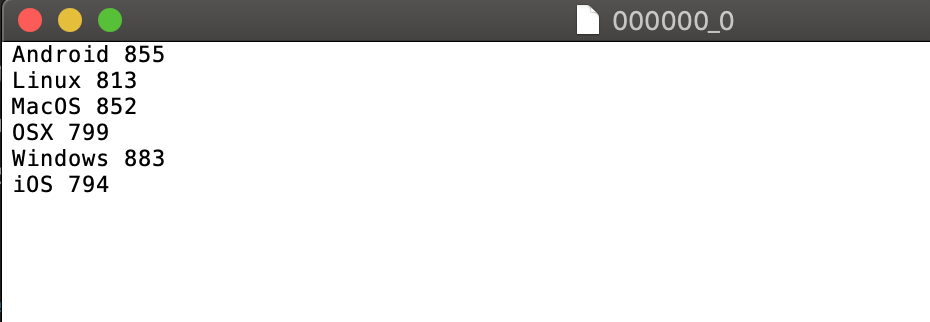

[QwikLab: Intro to Amazon Machine Learning](https://awseducate.qwiklabs.com/focuses/27?parent=catalog) (time: 55min)

In this lab, I learnt the basic steps of machine learning via **Amazon Machine Learning (Amazon ML)**, which is a robust machine learning platform that allows software developers to train predictive models and use them to create predictive applications. Here, I built out a simple Amazon ML model that be used to predict whether or not a customer would like a restaurant. The results of the prediction is based on a datasource of customer reviews. Here is the architecture of this lab:

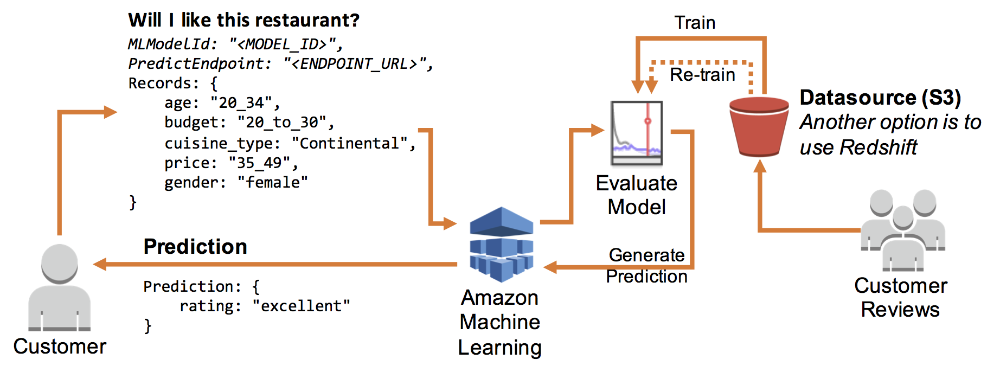

The first step is to use Amazon S3 to store the data of customer reviews. The second step is to create a datasource by import the data in S3 to a Amazon ML instance. When choosing *rating* as target variable, I can create the ML model and then evaluate it. By the way, the process of creating a ML model involves **evaluation** of the generated model. The datasource used to create the model is actually split into two different data sets. The first, which consists of 70% of the data, is used to train the model. The second, which consists of 30% of the data, is used to evaluate the model. When ML model is created, I can see the results as follows:

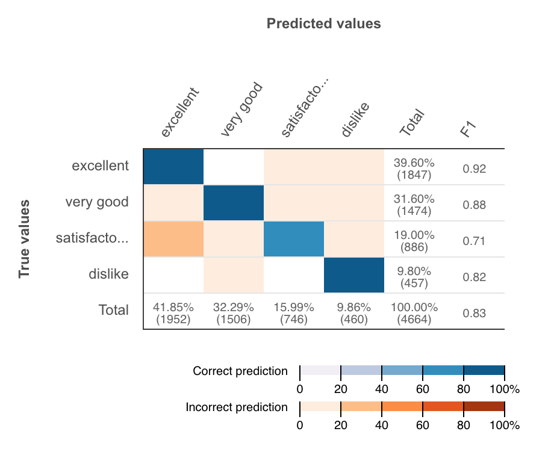

As we can see, the rows represent the *true values* and the columns represent the *predicted values*. The result cells are colored as dark blue which means the correction is very high but not perfect. Anyway, with this ML model, I can generate predictions (here I use real-time prediction) according to the input user data. For example, taking age as under_19, gender as male, budget as under_20, price as over_50, and cuisine_type as Continental, I can get the prediction results is `dislike`:

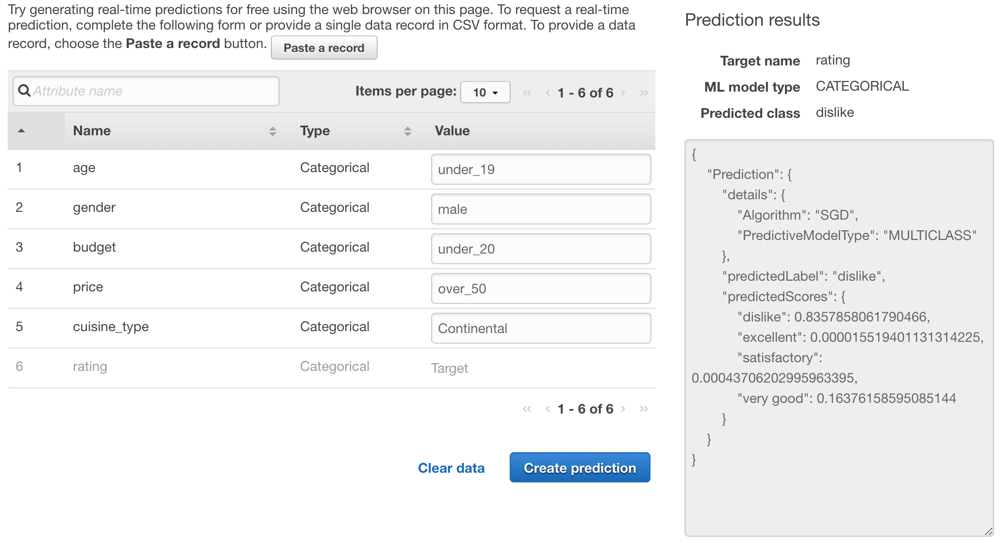

[AWS Tutorial: Build a Machine Learning Model](https://aws.amazon.com/getting-started/projects/build-machine-learning-model/?trk=gs_card) (time: 30min)

This tutorial goes on the topic of **Amazon ML** and the steps in this tutorial are same with those in last lab. However, when repeating the steps, I learnt something more about Amazon ML.

Step 1: Prepare the data. Just upload the data source to S3.

Step 2: Create a training datasource. I lauch the Amazon ML and import the data from S3. Here I need to establish a schema. A *schema* is the information Amzon ML needs to interpret the input data for an ML model, including names and their assigned data types, and the names of special attributes. There are two ways to provide Amazon ML with a schema. One is providing a separate schema file, the other is allowing Amazon ML to infer the attribute types and create a scheme automatically. In this tutorial, I ask Amazon ML to infer the schema because the attribute name has been provided in the source file.

Step 3: Create a ML Model. This step will done by Amazon ML.

Step 4: Review the ML Model's Predictive Performance and Set a Score Threshold. In this step, I can see the detailed information of accuration of this ML model. Besides, I can fine-tune the ML model performance metrics by adjusting the score threshold. Adjusting this value changes the level of confidence that the model must have in a prediction before it considers the prediction to be positive. It also changes how many false negatives and false positives I am willing to tolerate in my future predictions.

Step 5: Use the ML Model to Generate Prediction. In last lab, I used real-time prediction. A real-time prediction is a prediction for a single observation that Amazon ML generates on demand. Real-time predictions are ideal for mobile apps, websites, and other applications that need to use results interactively. An in this tutorial, I tried a different method: batch prediction. A batch prediction is a set of predictions for a group of observations. Amazon ML processes the records in a batch prediction together, so processing can take some time. Use batch predictions for applications that require predictions for set of observations or predictions that don't use results interactively.

The above is all I learnt from this tutorial.

[Video Tutorial: Overview of AWS SageMaker](https://www.youtube.com/watch?v=ym7NEYEx9x4&index=12&list=RDMWhrLw7YK38) + [AWS Tutorial: AWS SageMaker](https://docs.aws.amazon.com/sagemaker/latest/dg/whatis.html) (time: 90min)

The video tutorial and word tutorial introduce the same contents which is about **Amazon SageMaker**. From these two tutorial, I learnt that the Amazon SageMaker provides machine learning service for the data scientists and developers to quickly and easily build and train machine learning models, and then directly deploy them into a production-ready hosted environment. Compared with Amazon ML which is mentioned in last tutorial, Amazon SageMaker follows the similar work flow: generate example data (include fetch data, clean data, and transform data), train a model (include training the model and evaluating the model), and deploy the model. However, as I  tried to use Amazon SageMaker by following the tutorial, I learnt that the Amazon SageMaker is more flexible and powerful than Amazon ML. Here is my learning steps:

Firstly, I did some preparation jobs. I created an Amazon S3 bucket to store the model training data and the output data. Then I created an Amazon SageMaker Notebook instance, which is a machine learning EC2 compute instance running the Jupyter Notebook App. In a word, the SageMaker notebook provide an IDE for the data training control.

Secondly, I began the job of model training and deploying. Step one is to download the raw dataset to the notebook instance, review the data, transform it, and upload the training data to my S3 bucket. Next step is training the model. Here I can choose different training algorithm for my model and I use the K-means algorithm provided by Amazon SageMaker. To train a model, Amazon SageMaker provides the *CreateTrainingJob* API. I can use both high-level Python library provided by Amazon SageMaker and low-level AWS SDK for Python to call this API. Obviously the high-level libray need less codes than the low-level SDK for developers. After model training, I needed to deploy the model to get predictions. There are two ways:

- Set up a persistent endpoint to get one prediction at a time, using Amazon SageMaker hosting services.

- Get predictions for an entire dataset, using Amazon SageMaker batch transform.

Here I choose to set up a persistent endpoint to get one prediction at a time. The same way, I can use both high-level and low-level method for this job. I use high-level Phtyon library this time because it provides the `deploy` method that does all the task I need.

Finally, I had a model that is deployed in Amazon SageMaker. To validate the model, I used the `predict` method provided by high-level Python library and got the clusters that I need:

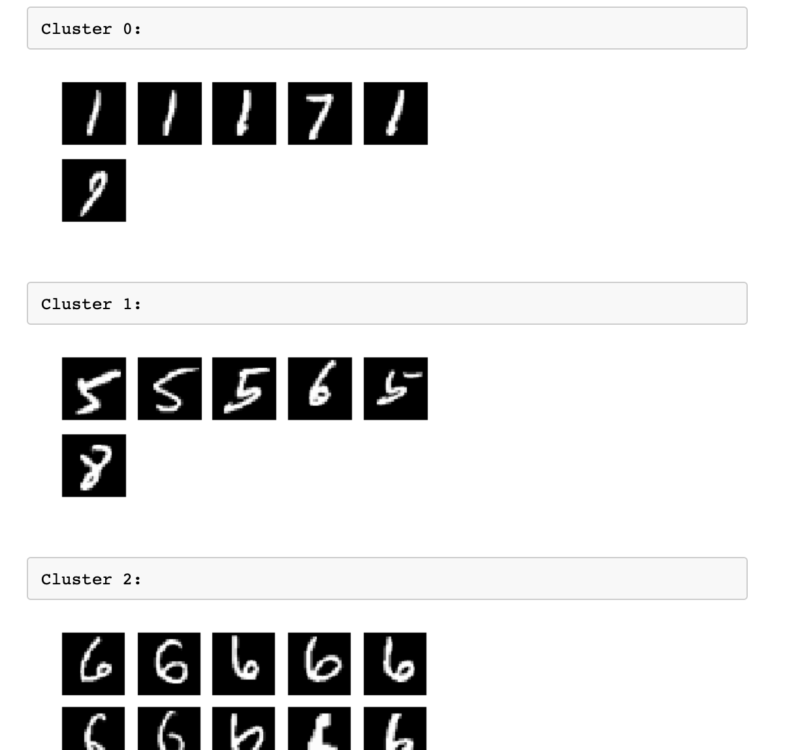

In addition, the tutorial gives some instructions about how to integrate Amazon SageMaker endpoints into internet-facing application. The simplest method is creating a Lambda function that calls Amazon SageMaker `InvokeEndpoint` API then calling the Lambda function from the target application.


> Bring it all together

[Build a Serverless Real-Time Data Processing App](https://aws.amazon.com/getting-started/projects/build-serverless-real-time-data-processing-app-lambda-kinesis-s3-dynamodb-cognito-athena/?trk=gs_card) (time: )

## Area 3 Docker and Containers

> Beginner Level

[Video: Why Docker?](https://www.youtube.com/watch?v=RYDHUTHLf8U&t=0s&list=PLBmVKD7o3L8tQzt8QPCINK9wXmKecTHlM&index=23) (time: 20 min)

This video introduces the benefits of Docker. When talking about docker, we need to know container first. As I learned in the Aera 1, a container is a set of software that packages up code and all its dependencies so the application can run quickly and reliably from one computing environment to another. A Docker container image is a typical container. The Docker can reduce the infrastructure and maintenance costs of supporting the application portfolio. I also learn the differences between containers and virtual machines, they have similar resource isolation and allocation benefits, but function differently. Containers virtualize the operation system instead of hardware, containers are more portable and efficient. The following is the detailed comparison between container and vm:

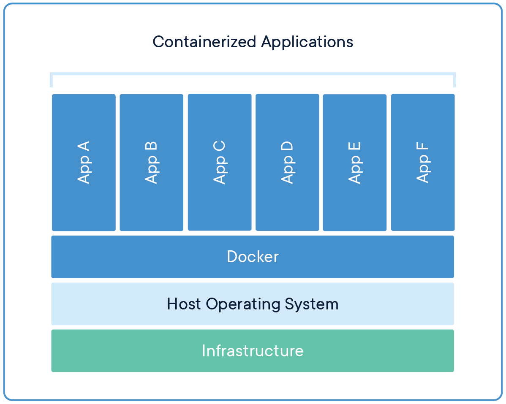

Containers are an abstraction at the app layer that packages code and dependencies together. Multiple containers can run on the same machine and share the OS kernel with other containers, each running as isolated processes in user space. Containers take up less space than VMs (container images are typically tens of MBs in size), can handle more applications and require fewer VMs and Operating systems.

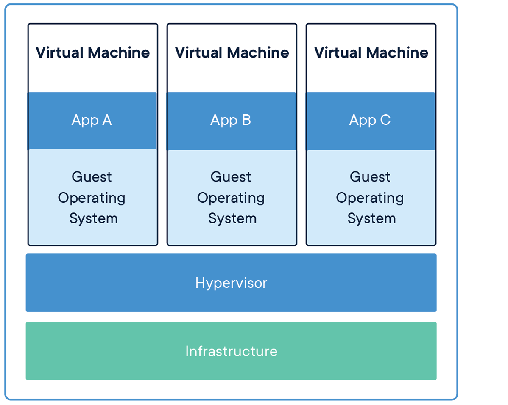

Virtual machines (VMs) are an abstraction of physical hardware turning one server into many servers. The hypervisor allows multiple VMs to run on a single machine. Each VM includes a full copy of an operating system, the application, necessary binaries and libraries - taking up tens of GBs. VMs can also be slow to boot.

[Lab: DevOps Docker Beginners Guide](https://training.play-with-docker.com/ops-s1-hello/) (time: 50min)

In this guide, I learnt the basic of how container work, how the Docker engine executes and isolates containers from eachother via some command line scripts.

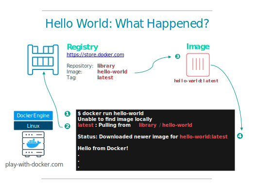

First, I execute the script `docker run hello-world` which means run the container named *hello-world*. Enssentially, the Docker engine running in my terminal tried to find an image named hello-world, if there are no images stored locally, the Docker engine goes to its default Docker register, which is **Docker Store**, to look for an image named *hello-world*. It finds the image there, pulls it down, and then runs it in a container.

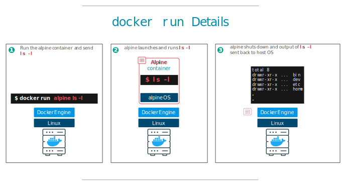

Second, I execute the command `docker container run alpine ls -l`, which means that I execute the command `ls -l` inside the container which name is *alpine*. Another similar script is `socker container run alpine echo "hello from alpine"`.


The third is about Docker container isolation. In the steps above I ran several commands via container instances with the help of `docker container run`. The `docker container ls -a` command showed us that there were several containers listed. Why are there so many containers listed if they are all from the alpine image? This is a critical security concept in the world of Docker containers. Even though each docker container run command used the same alpine image, each execution was a separate, isolated container. Each container has a separate filesystem and runs in a different namespace; by default a container has no way of interacting with other containers, even those from the same image. 
