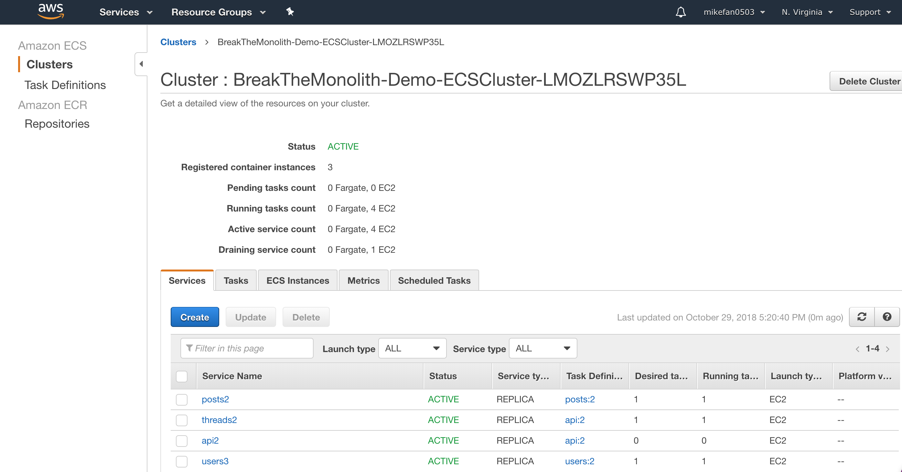
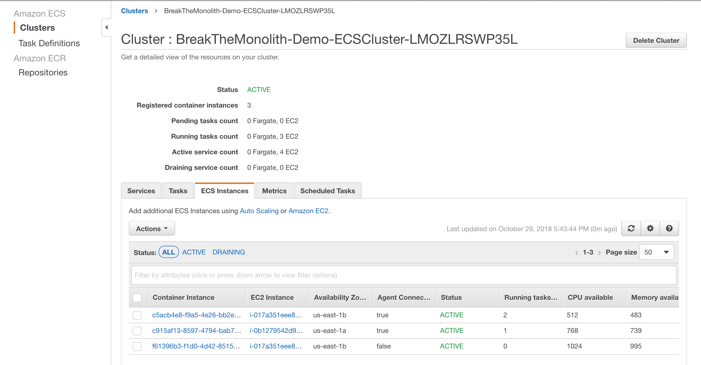

# Distributed Systems Practice
Notes from learning about distributed systems in [GW CS 6421](https://gwdistsys18.github.io/) with [Prof. Wood](https://faculty.cs.gwu.edu/timwood/)

## Docker and Containers
1. Why Docker? (10min)
* Docker (containerization) is becoming more popular
* Containerization can reduce cost and complexity
2. DevOps Docker Beginners Guide (45min)
* Docker image is a snapshot of a Docker container (can be obtained from Docker Store)
* Docker container is a running instance of a Docker image
* Use `docker run -it` to run the container under interactive mode
* The change in one container will not affect the image or other containers
3. What are Containers? (18min)
* The container is based on cgroups and process namespace of Linux
* The Docker image has a tree structure, which speeds up the rebuild process after any changes
* Structure of Docker (Host, daemon, volume, etc.)
4. VMs Versus Containers (8min)
* Containers are more "lightweight" and have faster booting time
* VM provides better isolation
* Containers can pack up all its dependencies (require less dependencies on OS level)
5. Docker Intro (20min)
* Use `docker container run --detach` to keep a container running in the background
* Use `docker exec` to execute a command inside a running container
* Docker images can be built from Docker files
* Bind mount can mount a directory from host to a container (easier file modification)
* Use `--publish` flag to map a host port to a port inside a container
6. Doing more with Docker Images (30min)
* Use `docker container commit` to create a new image from the change inside a docker container
* Dockerfiles can be used to build images
* The layer structure inside a docker image (skip all unmodified steps during building process)
7. VMs Versus Containers Deep Dive (9min)
* VMs generally have larger size than containers
* VM has slower booting time
* It's harder for a process to penetrate through the sandbox of container
8. Docker Networking (30min)
* `docker network inspect` will show the information of current networks on the Docker host in json format
* Use NAT for network between outside and container
9. Swarm Mode Introduction (30min)
* Compose controls multiple containers on a single system, while Swarm Mode also provides multi-host networking and other features such as load-balancing
* Swarm Mode is made up by containers acting as worker nodes or manager nodes
* A stack is made of several services (one or more containers)
* Use `docker service scale` to add more replicas to a service
10. Kubernetes vs Swarm (4min)
* Swarm is easier to set up but works better on simple architecture
* Kubernetes can automatically scale up the containers according to server traffic
* Swarm does load-balancing automatically
* Kubernetes is more powerful in general
11. Kubernetes in 5 Minutes (5min)
* The basic computation unit is a node
* A pod contains multiple nodes. The application can be scaled up in the unit of pods.
* A deployment controller controls how to create and run pods (example: number of replicas)
* k8s cluster service redistribute tasks to other pods if one of them is down
12. Learn more about Kubernetes on your own (30min)
* For example, `kubectl run kubernetes-bootcamp --image=gcr.io/google-samples/kubernetes-bootcamp:v1 --port=8080` will create a new deployment "kubernetes-bootcamp" using image "google-samples/kubernetes-bootcamp:v1" and run (expose) the application on the port 8080
* Use `kubectl scale` to scale up the application (create more replicas)
* Kubernetes automatically rollback to previous version if the new version fails
13. Install Docker on a cluster of EC2 VMs and use Kubernetes to orchestrate them (90min)

## Cloud Web Applications
1. AWS Tutorial: Launch a VM (15min)
* Choose the EC2 instance with the proper computation power and storage on AWS console
* Choose the right OS (linux distribution) for the EC2
* How to create a key pair for SSH login
* How to terminate the EC2 instance
2. QwikLab: Intro to S3 (12min)
* S3 stands for Simple Storage Service, which provides online storage
* User can manage the permission on each object, or change the permission of the entire bucket by editing the bucket policy
* S3 can store different version of each object by enabling versioning

