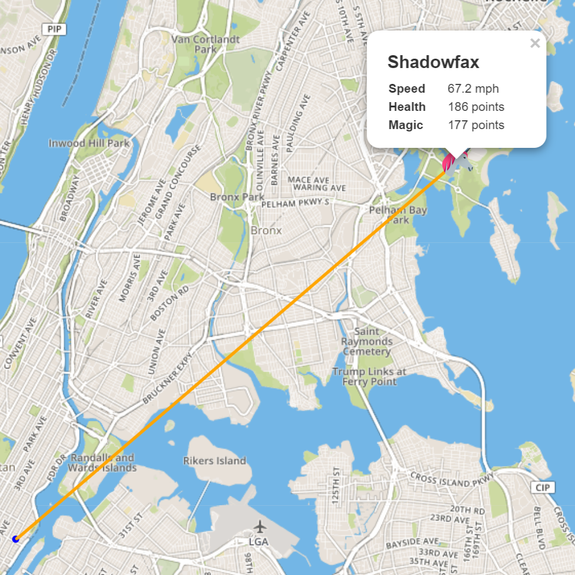
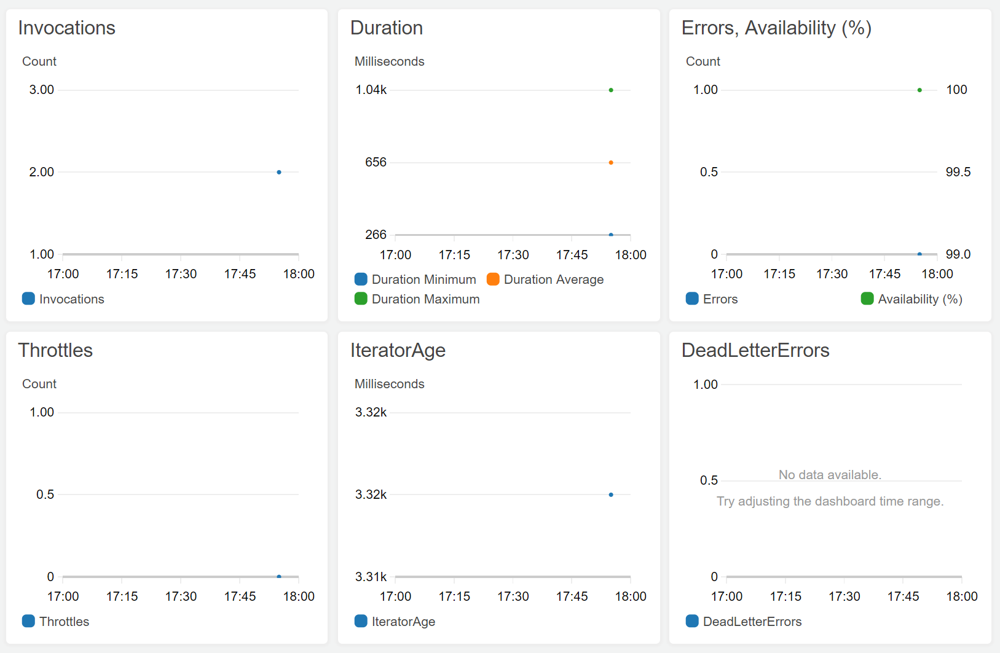
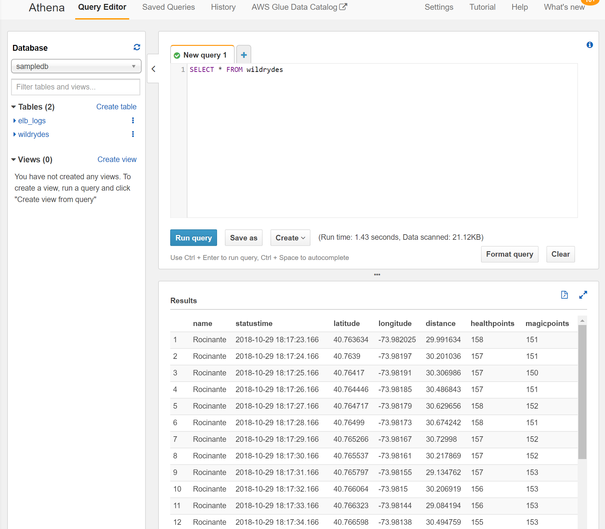
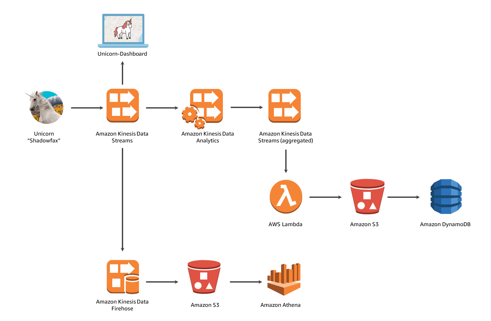

# Distributed Systems Practice
Notes from learning about distributed systems in [GW CS 6421](https://gwdistsys18.github.io/) with [Prof. Wood](https://faculty.cs.gwu.edu/timwood/)

## Area 1: Cloud Web Apps
* AWS Tutorial: Launch a VM (took ~15 minutes)
  * Used the EC2 Console to create an EC2 instance of type t2.micro
  * Used `ssh -i '<path-to-ssh-pem-file>' ec2-user@<ip-address>` to connect
  * After terminating instance, connection timed out when attempting to connect
* QwikLab: Intro to S3 (took ~20 minutes)
  * S3 stands for Simple Storage Service, which allows storage of objects in buckets which include backups and versioning
  * When uploading objects, there are different storage class options based on how long-lived and how freuqently accessed the data will be
  * Public read access can be granted to specific objects
  * ARN is Amazon Resource Name and in this case refers to a bucket
  * The policy generator can be used to create policies to put in the policy editor
  * New versions of a file can be uploaded and will display by default; additional permissions must be given to view old versions
* Video: Virtualization (took ~10 minutes)
  * Virtual machines have been used for a long time; software virtualization is more recent
  * The two (simple) privileged levels on Intel-based systems are ring 0 for the kernel and ring 3 for applications
  * Xen, an open-source VM architecture, has a small hypervisor running in ring 0
  * VMs have allowed old operating systems to run faster
  

## Area 2: Big Data and Machine Learning
* Video: Hadoop Intro (took ~15 minutes)
  * Distributed systems are used to deal with the data explosion
  * Hadoop is a framework inspired by a Google technical document to make distributed data processing easier
  * Hadoop is economical, reliable, scalable, and flexible
  * Traditional systems have data going to a program, while with Hadoop the program goes to the data
  * Hadoop has 12 components:
    * HDFS (Hadoop Distirbuted File System) is a storage layer for Hadoop
    * HBase is a NoSQL database that stores data in HDFS
    * Sqoop transfers data between Hadoop and relational database servers
    * Flume ingests streaming data
    * Spark is a cluster computing framework
    * Hadoop MapReduce is the original processing engine but is losing ground to Spark
    * Pig is a dataflow system primarily used for analytics that converts pig script to Map-Reduce code
    * Impala is a high-performance SQL engine with low latency
    * Hive is similar to Impala but is good for data processing
    * Cloudera Search enables non-technical users to search and explore data
    * Oozie is a workflow or coodination system used to manage Hadoop jobs
    * Hue (Hadoop User Experience) is a web interface for Hadoop
  * These components help with the four stages of big data processing: ingest, processing, analyze, and access
* QwikLab: Analyze Big Data with Hadoop (took ~20 minutes)
  * Set up an EMR cluster and an S3 bucket for output
  * The default EMR cluster configuration includes Apache Hadoop, Ganglia (performance monitor), Apache Tez (framework for creating a complex directied acyclic graph of tasks), Hive (data warehouse and analytics package), Hue (GUI), and Pig (converts Pig Latin to Tez jobs)
  * Amazon CloudFront speeds up web content distribution through worldwide network of edge location data centers
  * A step is a unit of work with one or more Hadoop jobs
  * Created a step with a Hive script that reads and parses CloudFront log files and then submits a HiveQL query to analyze requests per OS
  * Script took about a minute to process 5,000 rows
* QwikLab: Intro to S3 - already completed in Area 1
* QwikLab: Intro to Amazon Redshift (took ~20 minutes)
  * Amazon Redshift is a data warehouse allowing data analysis using SQL
  * Pgweb is a web application for SQL based on PostreSQL
  * Created a users table, then copied 49,990 rows from an S3 text file
  * Queried the data using SQL
* Video: Short AWS Machine Learning Overview (took ~3 minutes)
  * There are three layers of the machine learning stack:
    * Framework and Interfaces: used by companies with experts who build and train ML models
    * ML Platforms: make it easy to build, train, tune, and deploy models without expertise
    * Application Services: APIs for computer vision, speech processing, etc.
* AWS Tutorial: Analyze Big Data with Hadoop (took ~25 minutes)
  * Created an S3 bucket and an EC2 key pair
  * Launched an EMR cluster
  * Allowed SSH connections to cluster
  * Steps can be submitted to a cluster, configured when it is set up, or run on the command line after connecting to the master node
  * The script also analyzes CloudFront log files and determines the number of requests for each OS
* QwikLab: Intro to Amazon Machine Learning (took ~35 minutes)
  * Amazon ML allows software developers to build predictive models from supervised data sets
  * Docs: AWS Machine Learning
    * A datasource contains metadata about input data but not the data itself
    * An ML model generates predictions
    * An evaluation measures ML model quality
    * Batch predictions generate predictions for a set of observations
    * Real-time predictions generate predictions for single input observations with low latency
  * Started by adding data to an S3 bucket
  * Inputted the data into Amazon ML and identified the target variable
  * Amazon ML by default reserves 70% of data for training and 30% for evaluation
  * The confusion matrix shows a matrix of the true values and predicted values and the frequencies
  * Real-time predictions show predicted scores (adding up to 1) for each category
  * Real-time predictions can be done without submitting all of the input data values
* AWS Tutorial: Build a Machine Learning Model (took ~35 minutes)
  * The ML model creation roughly follows the previous tutorial except with different data
  * AUC (Area Under a Curve) is a quality metric for ML models
  * The score threshold can be adjusted to choose a balance of false positives and false negatives
  * Batch predictions can be done by linking to a new spreadsheet of input data; they cost $0.10 per 1,000 predictions
  * The results spreadsheet gives the best answer and the score; the score threshold determines the best answer based on the score
* Video Tutorial: Overview of AWS SageMaker (took ~30 minutes)
  * SageMaker is a machine learning service with four parts: notebook instances, jobs, models, and endpoints
  * The parts can be used independently or together 
  * The notebook instances run Jupyter notebooks
  * SageMaker has implementations of algorithms
  * In the xgboost_mnist notebook shown, the steps included configuration, data ingestion, data conversion before training
  * The algorithms are hosted in Docker containers; the user defines the parameters
  * Training can be done on a single instance or on multiple instances to speed it up; training is done as jobs
  * After training the model, it is hosted in a container so it can be used for predicting
  * SageMaker allows multiple models behind the same endpoint, which allows AB testing
  * After setting up the endpoint, predictions can be done and a confusion matrix can be generated
  * A user-generated algorithm in a separate Python file can also be used
  * SageMaker can also host already trained models, but they may need to be converted
  * You can also build your own algorithm Docker container
* AWS Tutorial: AWS SageMaker (took ~45 minutes)
  * Started by creating S3 bucket and SageMaker notebook instance
  * In the notebook, loaded the dataset, which is images of handwritten numbers
  * Configured the built-in k-means algorithm with data and output locations, etc.
  * Used `fit` method to begin training
  * Used `deploy` to create a model, an endpoint configuration, and an endpoint
  * Used `predict` to get inferences for 100 images; they were mostly accurate
* Build a Serverless Real-Time Data Processing App (took ~90 minutes)
  * Intro
    * Set up AWS Cloud9 IDE which runs in browser
  * Module 1: Build a data stream (Kinesis, Cognito)
    * Created a Kinesis stream with 1 shard (unit of throughput capacity)
    * Started the producer and consumer in separate terminals
    * Used Cognito to create an identity pool to grant unauthenticated users access to stream
    * Opened a web app that showed a live map of the coordinates being transmitted in the stream
    
  * Module 2: Aggregate data (Kinesis Data Analytics)
    * Created another stream with 1 shard for aggregated statistics
    * Started the producer so that Kinesis Data Analytics would automatically detect the schema
    * Created a Kinesis Analytics application and added a SQL query to aggregate stream data
    * A table with data from the SQL query updated every minute automatically
    * Connected the application to an output Kinesis stream
    * Used a consumer to view the aggregate stream in a terminal
    
  * Module 3: Process streaming data (DynamoDB, Lambda)
    * Created a DynamoDB table and configured a role for Lambda to access it
    * Set up a Lambda function running Node.js 6.10 and configured the Kinesis stream as a trigger
    * The function started saving the aggreagate data stream to the DyanmoDB table
    
  * Module 4: Store & query data (Kinesis Data Firehose, Athena)
    * Created a Kinesis Data Firehose delivery stream to put stream data into an S3 bucket
    * Created an Amazon Athena table with a query to use a JSON SerDe to get the data from the S3 bucket
    * The data then appeared in Athena
    
### Project Summary

This application processed data generated by a producer simulating unicorns travelling across New York City in a few different ways. First, the producer sent its data to an Amazon Kinesis stream, which could be directly accessed by a dashboard for viewing on a map. From there, a SQL query in Kinesis Data Analytics analyzed the data and sent aggregate statistics out another Kinesis stream every minute. A Lambda function was then used to take the data from this stream and save it in a DynamoDB table as it arrived via an S3 bucket. Meanwhile, a Kinesis Data Firehose was used to put the stream data into an S3 bucket which was then queried to be put into an Athena table.

## Area 3: Docker and Containers
* Video: Why Docker? (took ~10 minutes)
  * Docker started as an open-source project and is now a company
  * Major infrastructure shifts:
    * 90s: mainframe to PC
	* 00s: baremetal to virtual
	* 10s: datacenter to cloud
	* now: host to containers (serverless)
  * Docker is all about speed (of developing, building, testing, etc.)
  * Containers reduce complexity for heterogeneous systems
  * To migrate to Docker you don't need to rewrite your app, it's just a different way of packaging your app
* Lab: DevOps Docker Beginners Guide (took ~30 minutes)
  * `docker container run <container ID>` first checks for local images with the container ID and, if there are none, checks the Docker registry (the Docker Store by default)
  * A VM is a hardware abstraction, while a container is an application abstraction
  * Alpine is a lightweight Linux distribution so it is popular for many images
  * `docker image pull <image name>` fetches the image from the Docker registry and saves it in the system
  * `docker image ls` shows all images on system
  * `docker container run alpine ls -l` started a container based on the alpine image, ran `ls -l` inside, and then shut down
  * `docker container run -it alpine /bin/sh` starts an interactive terminal on a Docker container based on the alpine image
  * `docker container ls -a` shows containers running or that were run (without `-a` shows just the running ones)
  * Containers even from the same image are isolated with separate file systems by default
  * `docker container exec <container ID> <command>` sends a command to a running container
  * The Docker daemon runs on the host and the Docker client is the command line tool for the daemon
