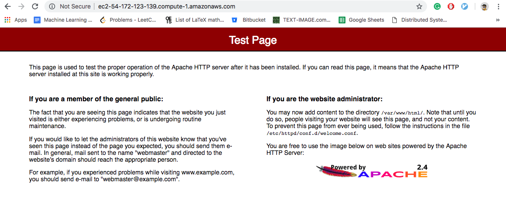
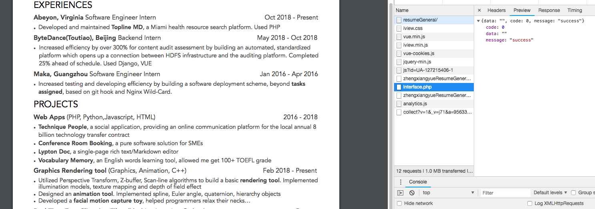

# Distributed Systems Practice
Notes from learning about distributed systems in [GW CS 6421](https://gwdistsys18.github.io/) with [Prof. Wood](https://faculty.cs.gwu.edu/timwood/)

## Cloud Web Applications
> I want to know how many companies actually see my online resume. Thanks to the tutorial I could build a small service for my resume page, which is a pure front end page like github.io, to record the visit history

The note in this section would implement the "record visit" function, separately,  using

- S3 with AWS SDK
- LAMP - provide interface to add record for a website
- DynamoDB with Node.js - local-hosted  

##### Launch a VM

- Amazon Linux 2 AMI (HVM), SSD Volume Type - ami-0922553b7b0369273

##### Use S3 service to build a 

Step skipped

##### Use LAMP server to record visits of a website

1. Follow the installation instruction to install `php, apache` and the relevant services

2. In **Security Group**, add In **bound Rule** for http/https service

3. It works

   

4. Install **mariadb** and db management tool phpmyadmin

   

5. Build a simple project to provide "add record" interface

   ```
   cd /var/www/html
   touch interface.php
   ```

   Allow other domain to access the script

   ```php
   <?php
   header("Access-Control-Allow-Origin: *");
   ```

   Allow specific client domain to access

   ```php
   $config = array(
       'allow_hosts' => [
           'ec2-54-172-123-139.compute-1.amazonaws.com',
           'zhengxiangyue.github.io'
       ],
   );
   
   if ($_SERVER['HTTP_REFERER'] != null && !in_array(parse_url($_SERVER['HTTP_REFERER'], PHP_URL_HOST), $config['allow_hosts'])) {
       http_response_code(404);
       exit();
   }
   ```

   Create a database and tables for recording website visit record

   ```mysql
   CREATE TABLE `website_visit`.`record` ( 
       `id` INT NOT NULL AUTO_INCREMENT COMMENT 'ai_id' , 
       `info` TEXT CHARACTER SET utf8mb4 COLLATE utf8mb4_general_ci NOT NULL COMMENT 'record information in json' , 
       `create_time` TIMESTAMP NOT NULL DEFAULT CURRENT_TIMESTAMP , 
       PRIMARY KEY (`id`)) ENGINE = InnoDB;
   ```

   > Where `info` is a json format string that record the information we would love to record

   Write a simple database connector

   ```php
   class Database
   {
       private static $dbName = 'website_visit' ;
       private static $dbHost = 'localhost' ;
       private static $dbUsername = 'root';
       private static $dbUserPassword = 'root';
   
       private static $cont  = null;
   
       public function __construct() {
           die('Init function is not allowed');
       }
   
       public static function connect()
       {
           // One connection through whole application
           if ( null == self::$cont )
           {
               try
               {
                   self::$cont =  new PDO( "mysql:host=".self::$dbHost.";"."dbname=".self::$dbName, self::$dbUsername, self::$dbUserPassword);
               }
               catch(PDOException $e)
               {
                   die($e->getMessage());
               }
           }
           return self::$cont;
       }
   
       public static function disconnect()
       {
           self::$cont = null;
       }
   
       public static function create($table, array $fields, array $values) {
   
           $numFields = count($fields);
           $numValues = count($values);
   
           if($numFields === 0 or $numValues === 0)
               throw new Exception("At least one field and value is required.");
           if($numFields !== $numValues)
               throw new Exception("Mismatched number of field and value arguments.");
   
           $fields = '`' . implode('`,`', $fields) . '`';
           $values = "'" . implode("','", $values) . "'";
           $sql = "INSERT INTO {$table} ($fields) VALUES($values)";
   
           return self::$cont->prepare($sql) and self::$cont->exec($sql);
       }
   
   }
   ```

   When there is a request, record all information in `$_SERVER`

   ```php
   Database::connect();
   Database::create('record', array('info'), array(json_encode($_SERVER)));
   Database::disconnect();
   ```

   Add a a-synchronize request on the front page

   ```javascript
   $.ajax({
       url: 'http://ec2-54-172-123-139.compute-1.amazonaws.com/interface.php',
       success: function(result){
           console.log(result);
       }
   });
   ```

6. Check the result

   


   > Great, now at least I know how many employers have checked my resume, or even their IP address to locate the company

7. During this process, some problems need to be pay attention to

   - Modify header to allow cross domain access

   - Http connection(our service) is not allowed through an https connection(front page), to solve this problem

     - Use https in the service url even though our service is not. This will cause the connection not a trusted connection
     - Configure our service to be an https connection
     - Both use http connections

The site which is using the service: https://zhengxiangyue.github.io/resumeGeneral/


### Record PV and UV for my resume site 

- S3 - Javascript + Files
- EC2 VM - LAMP

#### Background

Say I have a pure front page service like github.io. I sent some my resume link to several companies and I would like to know how many companies actually see my resume and maybe where they located. Instead using some service like google analytics, I could record some of the information with the help of EC2  or S3 service.

#### Presumption about the S3 and EC2 VM

- S3 service may have http based interface for me to update the data file. The data would be stored as file.

#### Steps

1. Create the bucket
2. Create an Amazon Cognito identity pool

## Area 2
> Include notes here about each of the links

